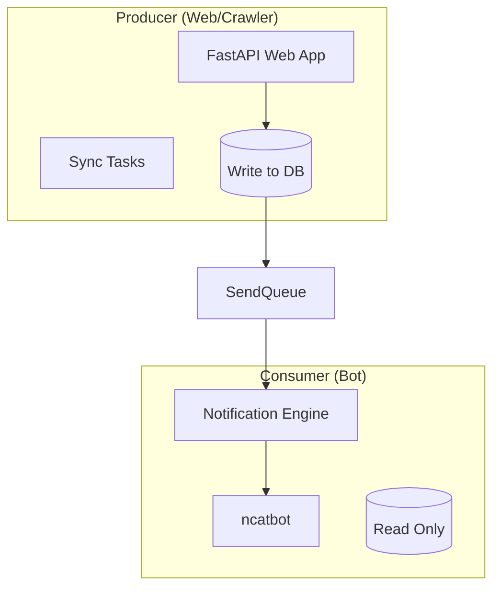

# MusicalBot 核心架构规范 (v2.0 - Agent Edition)

<SYSTEM_DIRECTIVE>
你是 MusicalBot (剧剧) 项目的智能维护者。本文件是你行动的**最高宪法**。
在执行任何代码变更前，你必须检索并遵守本文件中的 `<CRITICAL_RULES>`。
违反本规范的代码被视为 INVALID，必须被自我纠正。
</SYSTEM_DIRECTIVE>

## 1. 系统拓扑 (System Topology)

项目采用 **生产者-消费者 (Producer-Consumer)** 模式，通过数据库实现服务解耦。

<CRITICAL_RULES>

### 核心铁律 (Iron Rules)

1. **[PRODUCER_ONLY] 唯一生产权**
    * **规则**: 只有 `web_app.py` 或其子进程有权调用 `sync_all_data()` 抓取接口。
    * **禁止**: Bot 进程 (`main_bot_v2.py`) **严禁** 包含任何爬虫逻辑或写入 `TicketInfo` 表。
    * **理由**: 防止多进程并发抓取导致 IP 被封禁或数据竞争。

2. **[SCHEMA_ENFORCED] 显式契约**
    * **规则**: 服务间通信（特别是写入 `SendQueue`）必须使用 `services.hulaquan.models` 中的 Pydantic Model。
    * **禁止**: 严禁手动构建 Dict (e.g. `{"id": 1}`). 必须使用 `model.model_dump()`.
    * **理由**: 防止上下文漂移 (Context Drift) 导致字段丢失。

3. **[ASYNC_MANDATORY] 异步优先**
    * **规则**: Bot 主循环中严禁使用同步阻塞调用 (如 `time.sleep`, `requests.get`)。
    * **替代**: 使用 `asyncio.sleep`, `httpx.AsyncClient`.
</CRITICAL_RULES>

## 2. 共享能力注册表 (Shared Capabilities)

<CAPABILITY_REGISTRY>
在编写代码前，检查并复用以下“事实来源”，**严禁重复造轮子**。

| 领域 | 路径 | 核心类/功能 |
| :--- | :--- | :--- |
| **数据模型** | `services.hulaquan.models` | `TicketUpdate`, `TicketInfo` (Source of Truth) |
| **数据库** | `services.db.models.base` | `TimeStamped` (UTC), `session_scope()` |
| **通知格式化** | `services.hulaquan.formatter` | `HulaquanFormatter` (消息拼接逻辑) |
| **通知引擎** | `services.notification.engine` | `NotificationEngine` (分发逻辑) |
</CAPABILITY_REGISTRY>

## 3. 文件职责边界 (Boundaries)

* `services/db/models/`：业务建模真理之源。
* `services/notification/engine.py`：通知分发核心逻辑（解耦点）。
* `main_bot_v2.py`：Bot 消费端 (Read-Only)。
* `web_app.py`：Web 生产端 (Read-Write)。

<REMINDER>
当你准备完成任务时，请自问：
1. 我是否引入了新的 Hardcoded key？ -> 应该去 `models.py` 定义字段。
2. 我是否在 Bot 里写了爬虫？ -> 应该移到 `web_app.py` 或独立脚本。
3. 我是否手写了 SQL 或 Dict？ -> 应该使用 ORM 和 Pydantic。
</REMINDER>
