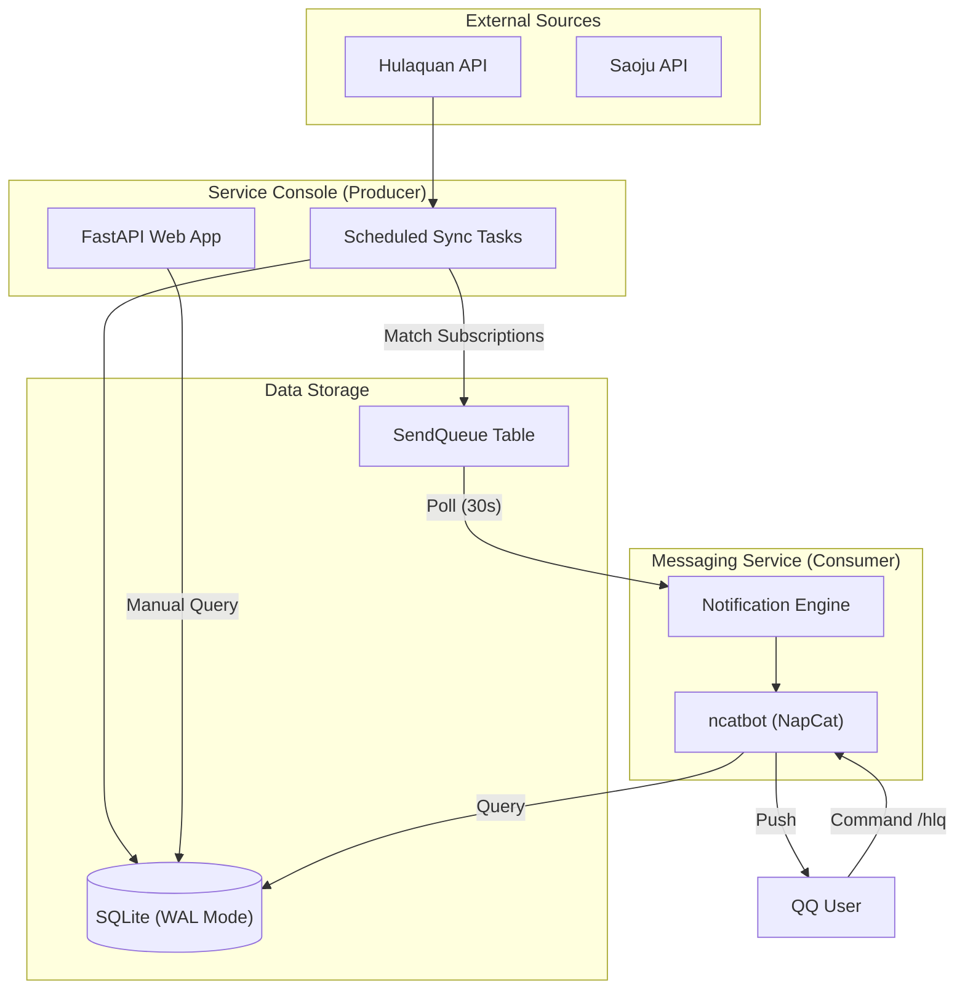

# MusicalBot 核心架构规范 (v1.0)

本文件是 MusicalBot (剧剧) 项目的最高设计准则。**所有 AI Agent 在进行任何代码修改前，必须完整阅读并遵守本规范。**

## 1. 系统拓扑与数据流向

项目采用 **生产者-消费者 (Producer-Consumer)** 模式，通过数据库实现服务间的解耦。

---

## 2. 服务职责定义

### A. Web 服务 & 爬虫 (The Producer)

- **唯一生产权**：只有 Web 服务（或其拉起的同步任务）有权调用 `sync_all_data()` 抓取接口。
- **业务逻辑中心**：负责对比新旧票务详情、匹配用户订阅。
- **入队责任**：计算出需要发送的消息后，只能写入 `SendQueue` 表，**禁止**直接在 Web 进程中调用 Bot API 发送。

### B. Bot 服务 (The Consumer)

- **轻量化消费**：Bot 服务的核心任务是轮询 `SendQueue` 并调用 `bot.api` 下发。
- **禁止抓取**：Bot 服务严禁包含任何会触发外部 API 抓取（如 Hulaquan 同步）的定时逻辑。
- **实时响应**：负责处理用户的 `/hlq`、`/date` 等实时查询指令，通过读取数据库（Read-only）直接回复。

---

## 3. 核心开发准则 (Important)

### 3.1 异步与并发

- **数据库锁控制**：由于使用 SQLite，所有写入操作必须通过 `session_scope()` 并在必要时使用 `_db_write_lock`。
- **非阻塞原则**：禁止在主事件循环中使用任何同步阻塞调用（如 `time.sleep` 或同步 `requests`）。

### 3.2 针对 AI Agent 的禁令

- **禁止冗余实现**：在实现新功能前，必须检查现有服务是否已有类似逻辑。严禁在 Bot 端复制 Web 端已有的爬虫代码。
- **配置一致性**：所有配置必须从 `.env` 加载，禁止硬编码（Hardcode）Token、ID 或 UIN。
- **标准化映射**：处理 QQ ID 时必须经过 `user_service` 或 `BotHandler.resolve_user_id` 进行 6 位 ID 标准化。

---

## 4. 关键文件索引

- `services/db/models/`：业务建模真理之源。
- `services/notification/engine.py`：通知分发核心逻辑（解耦点）。
- `main_bot_v2.py`：Bot 消费端。
- `web_app.py`：Web 生产端。
